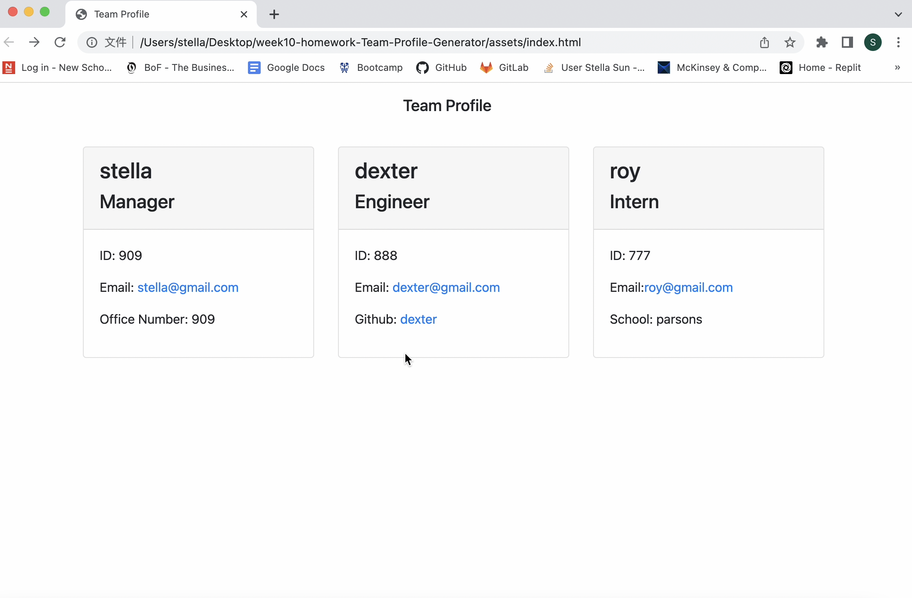

# week10-homework-Team-Profile-Generator

## Project Description

The Team Profile Generator is a command-line-input application run in Node that requests information from the user about members of an engineering team and generates an HTML file displaying that information. Before running the application the user must perform an npm install to install all required dependencies.

## Usage
Upon launching the app, the user is asked to describe the information of their team.   
The user enters the manager's name, user needs to enter the manager's ID, enters the manager's email address, and the user is prompted for the manager's office number. 
WHEN user click on an email address in the HTML
THEN user's default email program opens and populates the TO field of the email with the address 
Then user must enter another team member's information that will differ depending on what role was selected.   
If "Engineer" was selected, the app asks the user for the team member's GitHub username;   WHEN user click on the GitHub username  
THEN that GitHub profile opens in a new tab
if "Intern" was selected, the member's school is requested;   

## Tests

Run ``npm test`` to run Jest for tests on constructors.

## Project Video Link

View walk through video here -   

## Questions

If you have any questions about this projects, \
please contact me directly at stellasunmail@gmail.com;\
You can view more of my projects at https://github.com/Shuyu-Sun